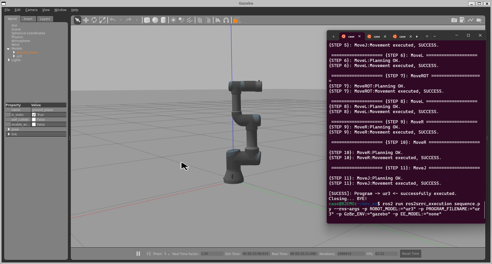

# ros2TopicPlotting

This project for STAT 600 utilizes RStudio and R as a programming language to interpret a ROS 2 file recording of a robotic manipulator motion. To do this, it utilizes ROS 2's bag feature, which can record and playback recorded topics in the same time as they were executed originally, to better track and troubleshoot robotic development.

This package is written within RStudio, and relies on a few external tools to accomplish this. 

The first is ROS 2. ROS 2 was developed to lower the development time that traditionally was associated with developing robotics, by creating an open-source middleware that created a standard method for combining the hardware and software for different peripherals and devices used in robotics, and providing the ability to publishing them in packages for others to use for their own purposes. This creates a plug-and-play system of software for robotics development, and is becoming the standard for robotics going forward. 

A brief background on the concept of ROS 2 topics (which are what the `ros2 bag` command is recording, and what this package will process) can be found at [ROS 2 topics](https://docs.ros.org/en/humble/Tutorials/Beginner-CLI-Tools/Understanding-ROS2-Topics/Understanding-ROS2-Topics.html), and the messages used can be found in their respective folders in the `src/` directory.

### To Get Started:
```
extract_topic_info("ur3_move") # this is the bag file that was generated by the simulation
# This will return a structured data frame which can then be used to plot
# To plot:
# In this example I am using 1 topic (/joint_states)
selected_data <- format_msg_csv("ur3_move", "joint_states")
update_plot(selected_data)
```

The UR3 simulation used to generate the data can be seen below:


